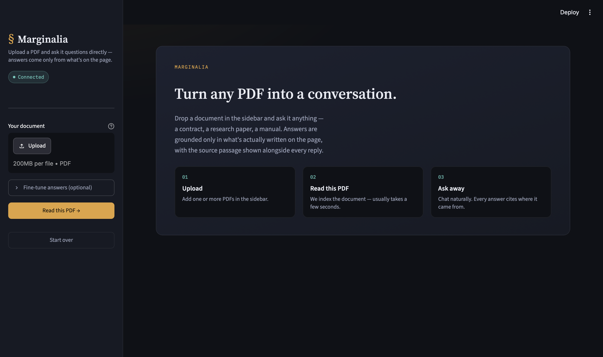
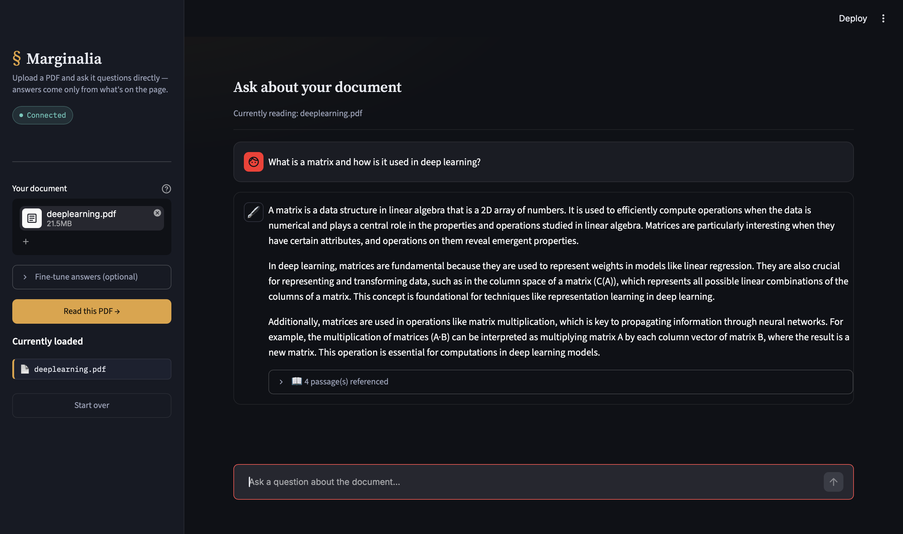

# 📖 Marginalia — Chat with your PDF

A Retrieval-Augmented Generation (RAG) app that turns any PDF into a conversation. Upload a document, and ask it questions directly — every answer is grounded only in what's actually written on the page, with the source passage shown alongside the reply.

Built with **Python**, **Streamlit**, **LangChain**, **ChromaDB**, and **Mistral AI**.

---

## 📸 Screenshots

| Empty state | Chat with citations |
|---|---|
|  |  |

> Add your own screenshots to a `docs/` folder in the repo and update the file names above to match. See [Adding screenshots](#-adding-screenshots) below for exact steps.

---

## ✨ Features

- **Upload and go** — drop in one or more PDFs, no setup required beyond an API key
- **Grounded answers** — responses are generated only from retrieved document content, not the model's general knowledge
- **Source citations** — every answer shows the exact page(s) and passage(s) it came from
- **Plain-language controls** — no chunk sizes or overlap sliders to figure out; just "Quick," "Balanced," or "Thorough"
- **Session-isolated** — each upload builds its own temporary vector index, so documents from different sessions never mix

---

## 🧱 How it works

1. **`create_database.py`** — loads the PDF(s), splits them into overlapping text chunks, embeds each chunk using a Hugging Face sentence-transformer model, and stores the embeddings in a local ChromaDB vector store.
2. **`main.py`** — defines the retrieval + generation pipeline: an MMR retriever pulls the most relevant chunks for a question, which are inserted into a prompt and sent to a Mistral chat model.
3. **`app.py`** — a Streamlit interface that wires the two together: upload, process, and chat, all in the browser.

```
PDF → chunk → embed → ChromaDB → retrieve → prompt → Mistral LLM → answer + sources
```

---

## 🚀 Getting started

### 1. Clone the repo

```bash
git clone https://github.com/AbhijitRoy893/Marginalia-RAG.git
cd Marginalia-RAG
```

### 2. Create a virtual environment (recommended)

```bash
python -m venv venv
source venv/bin/activate      # Windows: venv\Scripts\activate
```

### 3. Install dependencies

```bash
pip install -r requirements.txt
```

### 4. Add your Mistral API key

Create a `.env` file in the project root:

```
MISTRAL_API_KEY=your_key_here
```

Get a key at [console.mistral.ai](https://console.mistral.ai/). This file is gitignored and never uploaded.

### 5. Run the app

```bash
streamlit run app.py
```

Open the local URL Streamlit prints (usually `http://localhost:8501`), upload a PDF, and start asking questions.

---

## 📁 Project structure

```
Marginalia-RAG/
├── app.py               # Streamlit UI
├── create_database.py   # PDF ingestion → chunking → embeddings → ChromaDB
├── main.py               # Retriever, prompt, LLM, and CLI chat loop
├── requirements.txt
├── .gitignore
└── README.md
```

---

## 🖥️ Using it from the command line

Both `create_database.py` and `main.py` also run standalone, without the UI:

```bash
python create_database.py   # builds chroma_db/ from a hardcoded PDF path
python main.py               # terminal chat loop against that index
```

Useful for quick testing or scripting outside the browser.

---

## 🛠️ Tech stack

| Layer | Tool |
|---|---|
| UI | [Streamlit](https://streamlit.io/) |
| Orchestration | [LangChain](https://www.langchain.com/) |
| Embeddings | [sentence-transformers/all-MiniLM-L6-v2](https://huggingface.co/sentence-transformers/all-MiniLM-L6-v2) |
| Vector store | [ChromaDB](https://www.trychroma.com/) |
| LLM | [Mistral AI](https://mistral.ai/) (`mistral-small`) |

---

## 📸 Adding screenshots

1. In your project folder, create a `docs/` folder if it doesn't exist.
2. Take a screenshot of the app (e.g. the empty state, and a chat with an answer + citation card expanded) and save them into `docs/`, named `screenshot-home.png` and `screenshot-chat.png` — or any names you like, as long as you update the table above to match.
3. Stage, commit, and push as usual:
   ```bash
   git add docs/
   git commit -m "Add app screenshots"
   git push
   ```
4. Refresh the repo page on GitHub — the images will render directly in the README table.

---

## 🗺️ Roadmap ideas

- [ ] Persist indexes across sessions (currently session-only)
- [ ] Support additional file types (docx, txt)
- [ ] Multi-document source filtering in the UI
- [ ] Docker deployment

---

## 📄 License

No license file is currently included — add one (MIT is a common choice for projects like this) if you want others to reuse this code.

---

## 🙋 Author

Built by [Abhijit Roy](https://github.com/AbhijitRoy893).
